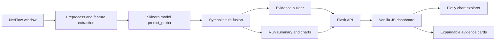

# Neuro-Symbolic NIDS

[](https://github.com/kishore0786k/NIDS/actions/workflows/ci.yml)
[](https://github.com/kishore0786k/NIDS/releases)
[](https://www.python.org/)
[](#license)

Publication-ready Network Intrusion Detection System for NF-ToN-IoT-V2 NetFlow traffic. The system combines a neural classifier with auditable symbolic rules, calibrated confidence, attribution evidence, and an interactive dashboard for run-level analysis.


## Quickstart

```bash
cp .env.example .env
docker compose up --build
```

Open the dashboard at `http://127.0.0.1:8080`. The API is available at `http://127.0.0.1:5000`.

Local Python run:

```bash
python -m venv venv
venv\Scripts\pip install -r requirements.txt
venv\Scripts\python -m backend.app
```

## Architecture



## Run All Pipeline

The `Run All` button starts an asynchronous job:

1. capture processed NetFlow rows
2. preprocess the selected deterministic window
3. extract and cache feature payloads
4. batch predict and apply symbolic rules
5. write structured audit logs
6. build visualization payloads

Status is polled at `/api/run/status/<job_id>`. The latest completed summary is written to `runs/last_run.json`.

## API Reference

| Endpoint | Method | Purpose |
| --- | --- | --- |
| `/health` | GET | Service health and last-run persistence state |
| `/api/run-all` | POST | Start full pipeline job; returns `job_id` |
| `/api/run/status/<job_id>` | GET | Poll progress, stage results, and final payload |
| `/api/single-flow` | GET | Predict one flow with evidence |
| `/api/charts` | GET | Chart and Plotly explorer data |
| `/api/defense/analyse` | POST | Create a defensive recommendation for one flow |
| `/api/export-charts` | POST | Persist rendered PNG chart exports |
| `/api/upload/validate` | POST | Validate upload size and file type |

## Evidence

Each prediction emits:

- top contributing features with SHAP or permutation-style attribution scores
- flow context such as IP, port, protocol, byte, packet, and timestamp fields when present
- raw confidence and calibrated/fused probability
- matched symbolic rule signatures
- historical frequency for the predicted attack class

The dashboard renders this as expandable evidence cards instead of a single paragraph.

## Model Card

**Dataset:** NF-ToN-IoT-V2 processed NetFlow CSV splits in `data/train_processed.csv` and `data/test_processed.csv`.

**Model:** sklearn-compatible classifier stored at `models/ns_nids_model.pkl`; optional robust model at `models/robust_nsnids.pkl`.

**Metrics:** Live dashboard metrics are recomputed from current model predictions. Publication summaries under `results/` are used only as saved reference artifacts.

**Limitations:** Results depend on the supplied processed split and may not generalize to unseen networks without external validation. Symbolic rules are audit aids, not a substitute for analyst review.

**Ethical Use:** Use for defensive monitoring, research reproducibility, and education. Do not deploy for unauthorized surveillance or automated punitive action without human oversight.

## Screenshots

- `results/dashboard-runall.png`
- `results/dashboard-impact-panel.png`
- `results/dashboard-architecture-final.png`

## Development

```bash
pytest
ruff check backend src tests
mypy --strict --ignore-missing-imports --follow-imports=skip backend/config.py backend/logging_config.py backend/run_manager.py
pip-audit -r requirements.txt
```

## Citation

```bibtex
@software{kishore_nids_2026,
  author = {Kishore},
  title = {Neuro-Symbolic Network Intrusion Detection System},
  version = {1.0.0},
  year = {2026},
  url = {https://github.com/kishore0786k/NIDS}
}
```

## License

MIT License. See `LICENSE`.
