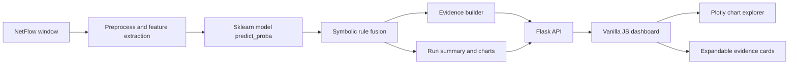

# Neuro-Symbolic NIDS

[](https://github.com/kishore0786k/NIDS/actions/workflows/ci.yml)
[](https://github.com/kishore0786k/NIDS/releases)
[](https://www.python.org/)
[](#license)

Publication-ready Network Intrusion Detection System for NF-ToN-IoT-V2 NetFlow traffic. We propose a cross-dataset, uncertainty-aware neuro-symbolic NIDS that detects known attacks and rejects low-confidence unseen traffic.


## Quickstart

```bash
cp .env.example .env
docker compose up --build
```

Open the dashboard at `http://127.0.0.1:8080`. The API is available at `http://127.0.0.1:5000`.

Local Python run:

```bash
python -m venv venv
venv\Scripts\pip install -r requirements.txt
venv\Scripts\python -m backend.app
```

## Architecture



## Run All Pipeline

The `Run All` button starts an asynchronous job:

1. capture processed NetFlow rows
2. preprocess the selected deterministic window
3. extract and cache feature payloads
4. batch predict and apply symbolic rules
5. write structured audit logs
6. build visualization payloads

Status is polled at `/api/run/status/<job_id>`. The latest completed summary is written to `runs/last_run.json`.

## API Reference

| Endpoint | Method | Purpose |
| --- | --- | --- |
| `/health` | GET | Service health and last-run persistence state |
| `/api/run-all` | POST | Start full pipeline job; returns `job_id` |
| `/api/run/status/<job_id>` | GET | Poll progress, stage results, and final payload |
| `/api/single-flow` | GET | Predict one flow with evidence |
| `/api/charts` | GET | Chart and Plotly explorer data |
| `/api/defense/analyse` | POST | Create a defensive recommendation for one flow |
| `/api/export-charts` | POST | Persist rendered PNG chart exports |
| `/api/upload/validate` | POST | Validate upload size and file type |

## Evidence

Each prediction emits:

- top contributing features with SHAP or permutation-style attribution scores
- flow context such as IP, port, protocol, byte, packet, and timestamp fields when present
- raw confidence and calibrated/fused probability
- matched symbolic rule signatures
- historical frequency for the predicted attack class

The dashboard renders this as expandable evidence cards instead of a single paragraph.

## Model Card

**Dataset:** NF-ToN-IoT-V2 processed NetFlow CSV splits in `data/train_processed.csv` and `data/test_processed.csv`.

**Model:** sklearn-compatible classifier stored at `models/ns_nids_model.pkl`; optional robust model at `models/robust_nsnids.pkl`.

**Metrics:** Live dashboard metrics are recomputed from current model predictions. Publication summaries under `results/` are used only as saved reference artifacts.

**Limitations:** Results depend on the supplied processed split and may not generalize to unseen networks without external validation. Symbolic rules are audit aids, not a substitute for analyst review.

**Ethical Use:** Use for defensive monitoring, research reproducibility, and education. Do not deploy for unauthorized surveillance or automated punitive action without human oversight.

## Screenshots

- `results/dashboard-runall.png`
- `results/dashboard-impact-panel.png`
- `results/dashboard-architecture-final.png`

## Development

```bash
pytest
ruff check backend src tests
mypy --strict --ignore-missing-imports --follow-imports=skip backend/config.py backend/logging_config.py backend/run_manager.py
pip-audit -r requirements.txt
```

## Cross-dataset generalization (NF-UNSW-NB15)

Cross-dataset evaluation is provided by `evaluate_cross_dataset.py`. The script loads the trained model from `models/ns_nids_model.pkl`, discovers the NF-UNSW-NB15 NetFlow download from the UQ NIDS dataset page when `--data_path` is absent, aligns columns to the NF-ToN-IoT-V2 feature schema, and saves robustness metrics to `results/cross_dataset_results.json`.

```bash
venv\Scripts\python evaluate_cross_dataset.py --model_path models\ns_nids_model.pkl --data_path data\NF-UNSW-NB15-v3.csv
```

Cross-dataset numbers are a robustness test, not the main in-domain accuracy headline. The script reports known-label closed-set macro-F1 separately from open-set `UNKNOWN` abstention metrics so an abstaining proposed system is not compared unfairly against a non-abstaining baseline.

## Unknown-traffic handling

### UNKNOWN abstention (confidence thresholding)

The backend computes softmax confidence and entropy before symbolic rule fusion. If calibrated `max_prob < tau`, the flow is flagged for `UNKNOWN` review, but the closed-set label is retained for the main DNN-only vs DNN+rules vs proposed comparison. This keeps abstention separate from ordinary classification accuracy.

```yaml
unknown_confidence_threshold: 0.35
```

For publication scripts, `tau` is tuned on a validation split carved from `data/train_processed.csv` using the grid `0.20, 0.25, ..., 0.80`. The held-out test split is used only after temperature, tau, and soft rule-fusion parameters are selected.

## Ablation study results

Run:

```bash
venv\Scripts\python ablation_study.py --model_path models\ns_nids_model.pkl --data_path data\test_processed.csv
```

This writes the publication tables:

- Table A closed-set comparison: `results/ablation_table.csv`
- Table B UNKNOWN abstention and calibration: `results/open_set_abstention_table.csv`
- Table C cross-dataset robustness: `results/cross_dataset_table.csv`
- Validation-selected protocol details: `results/publication_reporting_protocol.json`

Do not compare raw F1 for a proposed system that is allowed to output `UNKNOWN` against a baseline that is not. Table A keeps every system in the same closed-set label space; Table B reports rejection rate, benign UNKNOWN false-positive rate, accepted coverage, accepted macro-F1, and ECE.

## Calibration analysis

Run:

```bash
venv\Scripts\python calibration_analysis.py --model_path models\ns_nids_model.pkl --data_path data\test_processed.csv
```

The analysis fits temperature scaling on the validation split, applies calibrated probabilities to the test split, computes 10-bin Expected Calibration Error (ECE), and writes a reliability diagram to `results/calibration_curve.png`. The JSON output records the selected temperature, tuned tau, soft-fusion parameters, closed-set ECE, and separate abstention metrics.

## Citation

```bibtex
@software{kishore_nids_2026,
  author = {Kishore},
  title = {Neuro-Symbolic Network Intrusion Detection System},
  version = {1.0.0},
  year = {2026},
  url = {https://github.com/kishore0786k/NIDS}
}
```

## License

MIT License. See `LICENSE`.
