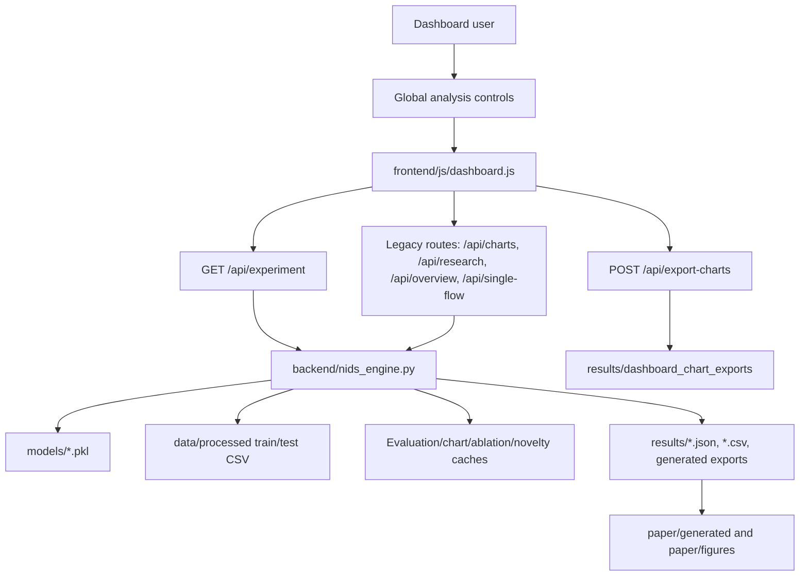

# Architecture Review

## Scope

This audit covers the current research dashboard and publication pipeline under:

- `backend/`
- `frontend/`
- `paper/`
- `results/`

The project is already organized around a Flask API, a vanilla JavaScript dashboard, processed CSV/model artifacts, and generated paper assets. The highest-value path is to keep that architecture and harden it into a parameter-driven research demonstrator.

## Current Architecture

## Findings

### Static Or Stale Surfaces

- `frontend/index.html` is a single-page shell with all sections present at load time. This is acceptable, but the page depends heavily on `frontend/js/dashboard.js` to keep sections synchronized.
- Older routes such as `/api/charts`, `/api/research`, `/api/overview`, `/api/single-flow`, and `/api/comparison` remain active for compatibility. They are useful, but they can become stale if the dashboard consumes them independently instead of using one experiment payload.
- `results/` contains many historical static figures and QA screenshots. These are useful evidence artifacts, but they should not be treated as live dashboard data unless the current experiment context is recorded beside the export.
- `paper/generated/` and `paper/figures/generated/` are generated outputs. They should be reproducible from current backend payloads, not hand-edited.

### Duplicated Computation

- `backend/nids_engine.py` centralizes model loading and evaluation in `_evaluate_window(...)`, which is the correct core abstraction.
- `classification_report`, ranking curves, and confusion matrices are still the most expensive surfaces to protect. Any endpoint that bypasses `_evaluate_window(...)` or recomputes report/curve surfaces can add visible latency.
- `chart_data(...)`, `ablation_data(...)`, `novelty_data(...)`, and `overview_data(...)` should reuse the shared evaluated payload wherever possible.
- `generate_publication_package.py` reads dashboard-style payloads to create figures and tables. It should remain a downstream consumer rather than duplicating dashboard evaluation logic.

### Cache And Payload Issues

- In-memory caches exist for evaluation, analysis, charts, novelty, ablation, and feature-window payloads. The key must remain the canonical experiment tuple: `window`, `flow`, `alpha`, `beta`, `fusion`, `seed`.
- Cache observability is currently limited to status payloads. The UI and generated exports should continue surfacing the parameter hash to make reproduced figures traceable.
- Flask development reloader/process restarts clear in-memory caches. This is acceptable for the current app, but publication demos should avoid claims that require persistent cross-session cache state.
- Run All clears caches through the pipeline path. This is correct, but it means live dashboard latency can temporarily spike after a pipeline run.

### Non-Reactive UI Sections

- The Overview, Charts, Cyber Defence, and 3D System sections must consume one active experiment context. A shared frontend context prevents accidental drift between charts, selected flow, and 3D explanations.
- UI controls should preview pending values while editing, but Apply should be the single source of truth that commits a new experiment context.
- Any fallback chart data or static metric arrays are risky because they can hide backend failures behind plausible-looking figures.
- The 3D System should be a research explainer, not a decorative scene. Each stage must bind to current metrics, selected-flow confidence, entropy, rules, and defense action.

### Backend Bottlenecks

- First model/data load is the largest cold-start cost. Publication demos should pre-warm `/api/health` or `/api/experiment` before presentation.
- `_get_symbolic_context()`, calibration temperature fitting, probability alignment, and rule batch evaluation are expensive enough to justify cache reuse and avoiding duplicate calls per parameter set.
- ROC/PR construction can be expensive for larger windows and should be built once per evaluated score surface.
- SHAP/permutation-style feature evidence can be costly for selected flows. It should remain scoped to the selected flow or cached payload, not all rows.

## Improvement Plan

### Phase 2: Experiment Context

- Make the frontend experiment object use exactly `window`, `flow`, `alpha`, `beta`, `fusion`, and `seed`.
- Keep Apply as the commit point for the active context.
- Ensure Overview, Charts, Cyber Defence, and 3D System read from the same payload and parameter hash.

### Phase 3: Backend Optimization

- Treat `_evaluate_window(...)` as the only heavy live evaluation path.
- Reuse classification reports, ROC, PR, confusion matrix, ablation, robustness, and novelty payloads by parameter hash.
- Add timing checks around `/api/experiment` warm-cache refreshes.

### Phase 4 and 5: Dynamic Overview And Charts

- Remove static metric fallbacks from user-facing charts.
- Make all cards, figure captions, deltas, and chart canvases update from the active experiment payload.
- Include parameter hash and context metadata in exports.

### Phase 6: Publication Metrics

- Strengthen realistic proposed-vs-existing separation without fabricating results.
- Keep closed-set classification metrics separate from UNKNOWN review/abstention metrics.
- Ensure captions and tables do not count abstention as a correct classification unless the protocol explicitly supports it.

### Phase 7 to 9: 3D Research Simulator

- Keep the existing Three.js scene and add stage-specific camera targets, highlighted nodes, metric panels, and replay.
- Improve renderer pixel ratio, text textures, contrast, lighting, and framing for screenshot-quality demos.

### Phase 10 to 12: Validation, Exports, Final Readiness

- Add or document cross-dataset, baseline, ablation, and statistical reporting protocols.
- Generate publication figures from current experiment payloads.
- Produce a final readiness report with strengths, remaining weaknesses, and future work.

## Dependency Graph Notes

- `backend/app.py` is the API boundary. Route compatibility should be preserved.
- `backend/nids_engine.py` is the live evaluation engine and cache owner.
- `frontend/js/dashboard.js` is the ExperimentContext owner in the browser.
- `frontend/index.html` and `frontend/css/style.css` are presentation shells and should avoid embedding research constants.
- `results/` and `paper/` are generated evidence consumers. Their contents should be reproducible from backend payloads and export metadata.

## Validation Strategy

- Use `ruff` and `py_compile` for backend syntax and lint checks.
- Use `node --check` for dashboard JavaScript syntax.
- Use the existing pytest smoke tests after code-affecting phases.
- Use browser validation after rendered UI phases: Apply, Overview, Charts, Cyber Defence, 3D stages, replay, export, console logs, and route health.
